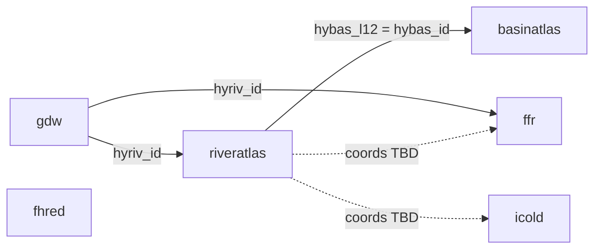

# Super Basin Atlas Dam Database (SuperBaDD)


The **Super Basin Atlas Dam Database** links two major global current dam datasets (Global Dam Watch and ICOLD) to river-network context from HydroATLAS and connectivity metrics from the Free-Flowing Rivers dataset. The goal is to enable fast SQL-based exploration of how river attributes relate to the dams to support planning for future hydrpower projects as well as dam removal effects. 

## Purpose

- Compare dam attributes (discharge, capacity, country) with river-network context (`main_riv`, basin footprint) and FFR fields such as CSI.
- Analyze **GDW**, **ICOLD** and **FHReD** barrier registers.
- Keep a **reproducible workflow**: raw files → clean script → Parquet → ingest → notebooks / SQL.

## What is in the database

Raw GDB layers are **not** committed here. Obtain **GDW v1.0**, **HydroATLAS v10** (BasinATLAS + RiverATLAS), and **FFR v1** from Global Dam Watch / HydroSHEDS, as well as **FHReD** and **ICOLD** spreadsheets; place them under `data/raw/` using the names in `scripts/clean_data.py`. The cleaning script will read those files, apply transformations, and write cleaned Parquet files to `data/clean/` for ingestion.

| Table | Source | Role |
|--------|--------|------|
| `gdw` | [Global Dam Watch](https://www.globaldamwatch.org/) | Dam points, discharge, capacity, `hyriv_id` |
| `riveratlas` | [HydroATLAS RiverATLAS](https://www.hydrosheds.org/hydroatlas) | Reach geometry, `main_riv`, `hybas_l12`, climate/terrain covariates |
| `basinatlas` | [HydroATLAS BasinATLAS](https://www.hydrosheds.org/hydroatlas) | Basin polygons, `hybas_id` |
| `ffr` | [Free-Flowing Rivers](https://figshare.com/articles/dataset/Mapping_the_world_s_free-flowing_rivers_data_set_and_technical_documentation/7688801) | Segment-scale connectivity and discharge metrics on `hyriv_id` |
| `fhred` | [FHReD 2015](https://www.globaldamwatch.org/fhred/) | Planned / future dams → `fhred.parquet` |
| `icold` | [ICOLD World Register](https://www.icold-cigb.org/GB/publications/world_register_of_dams.asp) | Alternative Current-dam register (separate from GDW) → `icold.parquet` |

Geometry is stored as DuckDB `GEOMETRY` after ingest for GDB-backed tables (`INSTALL spatial` / `LOAD spatial` in `scripts/ingest.py`).

## Logical schema and keys

DuckDB builds tables from Parquet without explicit `PRIMARY KEY` clauses; below is how joins are **meant** to work in analysis.

| Table | Natural key (concept) | Joins on |
|--------|------------------------|-----------|
| `gdw` | One row per dam (`gdw_id` is the dam id) | `hyriv_id` → `riveratlas.hyriv_id`, `ffr.hyriv_id` |
| `riveratlas` | One row per river reach | `hyriv_id`; `hybas_l12` → `basinatlas.hybas_id`; `main_riv` tags the whole river system |
| `basinatlas` | One row per basin polygon | `hybas_id` |
| `ffr` | One row per reach in the FFR network | `hyriv_id` (same id space as RiverATLAS / GDW) |
| `fhred` | One row per future-dam record (spreadsheet) |  **coordinate** key coming soon! |
| `icold` | One row per register record (spreadsheet) | **coordinate** key coming soon! |

### Entity-relationship diagram



## Data cleaning

Implemented in [`scripts/clean_data.py`](scripts/clean_data.py) (and runnable from [`notebooks/data_cleaning.ipynb`](notebooks/data_cleaning.ipynb)):

- **Column names:** lowercased, spaces → underscores so SQL stays consistent.
- **Missing values in GDW:** `-99` and `"-99"` replaced with `NaN` (GDW’s missing-value flag).
- **FFR join key:** GDB column `reach_id` renamed to `hyriv_id` so FFR lines up with GDW and RiverATLAS.
- **Excel registers (`fhred`, `icold`):** object columns coerced to string so mixed int/text cells.
- **Format / integrity:** GDB outputs are **GeoParquet** so geometries are not flattened before DuckDB ingest.

## Analytical question (example SQL)

**Question:** For dams in **Turkey**, which report the highest **discharge** (`dis_avg_ls`), and what is the **average CSI** on the linked FFR segment?

**Answer in SQL:** [`sql/analytical_query.sql`](sql/analytical_query.sql) — joins `gdw` to `ffr` on `hyriv_id`, filters by country, aggregates, orders, limits.

**Visualization and deeper exploration:** [`notebooks/dam_river_network.ipynb`](notebooks/dam_river_network.ipynb) — one dam, its `main_riv` network, other dams on that network, summary tables, and a static map.

## Repo Organization and docs are organized as follows:

- `scripts/clean_data.py` — raw inputs → `data/clean/*.parquet`
- `scripts/ingest.py` — Parquet → `database/superbadd.duckdb`
- `sql/` — analytical, verification, and join-template SQL
- `notebooks/data_cleaning.ipynb` — runs the cleaning script
- `notebooks/dam_river_network.ipynb` — maps + summaries + Ibis/SQL example
- `workflow/build_db.sql` — optional CLI mirror of ingest
- `requirements.txt` — Python packages (`pip install -r requirements.txt`)

## Reproduce

1. **Python 3.10+** and a virtual environment.
2. `pip install -r requirements.txt`.
3. Put source files under `data/raw/` (paths and sheet rules live in `scripts/clean_data.py`).
4. From the **repository root**:

```bash
python scripts/clean_data.py
python scripts/ingest.py
```

5. Open the notebooks with the repo root (`/SuperBasinDamDatabase`) as the working directory when possible.

**Database file:** `database/superbadd.duckdb` is created locally, is **gitignored**, and is rebuilt by anyone who runs the steps above.

## Adding a table

1. **Parquet file** — Create `data/clean/<table_name>.parquet` (same stem you want as the SQL table name). Use `clean_data.py` or any other tool; geometry columns should be written in a format DuckDB + spatial can read if you need maps.
2. **Ingest list** — Append `"<table_name>"` to the **`TABLES`** tuple in [`scripts/ingest.py`](scripts/ingest.py).
3. **Tabular-only optimization (optional)** — If the new table has **no** geometry columns and you want fast partial ingests without loading the spatial extension, add its name to **`TABULAR_TABLES`** in the same file. Skip this if the table has geometry (full ingest loads spatial).
4. Explore with SQL and notebooks!

## References

- This repository was made in the course **EDS 213: Databases and Data Management** at the [UCSB Bren School](https://bren.ucsb.edu/) as part of the Masters of Environmental Data Science Program.
- Huge thank you to the creators of the source datasets: **Global Dam Watch**, **HydroATLAS**, **Free-Flowing Rivers**, **FHReD**, and **ICOLD**.
- And the professors and TAs who helped with the workflow, SQL, and Python: **Annie Adams**, **Julien Brun** and **Greg Janee**. It has been a great learning experience building this database!

