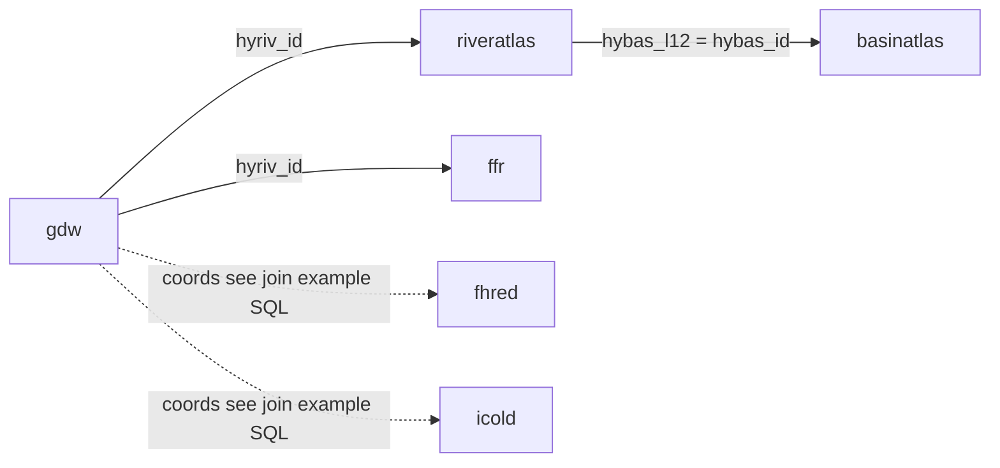

# SuperBADD

**Super Basin Atlas Dam Database** — Global Dam Watch dams linked to HydroATLAS river reaches and basins and to FFR segment metrics, stored in DuckDB for SQL analysis and maps. Optional registers: **FHReD** (future dams) and **ICOLD** (World Register of Dams, current).

## Purpose

- Compare dam attributes (discharge, capacity, country) with river-network context (`main_riv`, basin footprint) and FFR fields such as CSI.
- Optionally compare **GDW** to **ICOLD** or **FHReD** registers (see coordinate join notes below).
- Keep a **reproducible path**: raw files → clean script → Parquet → ingest → notebooks / SQL.

## What is in the database

| Table | Source | Role |
|--------|--------|------|
| `gdw` | [Global Dam Watch](https://www.globaldamwatch.org/) | Dam points, discharge, capacity, `hyriv_id` |
| `riveratlas` | HydroATLAS RiverATLAS | Reach geometry, `main_riv`, `hybas_l12`, climate/terrain covariates |
| `basinatlas` | HydroATLAS BasinATLAS | Basin polygons, `hybas_id` |
| `ffr` | FFR v1 (Grill et al., 2019) | Segment-scale connectivity and discharge metrics on `hyriv_id` |
| `fhred` | FHReD 2015 (`FHReD_2015_future_dams.xlsx`, **2nd worksheet**) | Planned / future dams → `fhred.parquet` |
| `icold` | ICOLD World Register (`world_register_dams_2025.xlsx`) | Current-dam register (separate from GDW) → `icold.parquet` |

Geometry is stored as DuckDB `GEOMETRY` after ingest for GDB-backed tables (`INSTALL spatial` / `LOAD spatial` in `scripts/ingest.py`). Spreadsheet tables are usually all scalar columns unless the xlsx includes geometry.

## Logical schema and keys

DuckDB builds tables from Parquet without explicit `PRIMARY KEY` clauses; below is how joins are **meant** to work in analysis.

| Table | Natural key (concept) | Joins on |
|--------|------------------------|-----------|
| `gdw` | One row per dam (`gdw_id` is the dam id) | `hyriv_id` → `riveratlas.hyriv_id`, `ffr.hyriv_id` |
| `riveratlas` | One row per river reach | `hyriv_id`; `hybas_l12` → `basinatlas.hybas_id`; `main_riv` tags the whole river system |
| `basinatlas` | One row per basin polygon | `hybas_id` |
| `ffr` | One row per reach in the FFR network | `hyriv_id` (same id space as RiverATLAS / GDW) |
| `fhred` | One row per future-dam record (spreadsheet) | No automatic key to `gdw` — inspect columns; **coordinates** are the usual way to relate registers to GDW |
| `icold` | One row per register record (spreadsheet) | Same as `fhred`: align lat/lon (or other) columns after `DESCRIBE`, then join or buffer in SQL |



Coordinate join template (rename columns to your `DESCRIBE` output): [`sql/join_register_to_gdw_example.sql`](sql/join_register_to_gdw_example.sql).

If your course asks for a **formal schema diagram on Canvas**, use the same entities and keys as above; this figure is the in-repo version.

## Data cleaning

Implemented in [`scripts/clean_data.py`](scripts/clean_data.py) (and runnable from [`notebooks/data_cleaning.ipynb`](notebooks/data_cleaning.ipynb)):

- **Column names:** lowercased, spaces → underscores so SQL stays consistent.
- **Missing values in GDW:** `-99` and `"-99"` replaced with `NaN` (GDW’s missing-value flag).
- **FFR join key:** GDB column `reach_id` renamed to `hyriv_id` so FFR lines up with GDW and RiverATLAS.
- **Excel registers (`fhred`, `icold`):** object columns coerced to string so mixed int/text cells (e.g. names with numeric codes) still write clean Parquet.
- **Format / integrity:** GDB outputs are **GeoParquet** so geometries are not flattened before DuckDB ingest.

## Analytical question (example SQL)

**Question:** For dams in **Turkey**, which report the highest **discharge** (`dis_avg_ls`), and what is the **average CSI** on the linked FFR segment?

**Answer in SQL:** [`sql/analytical_query.sql`](sql/analytical_query.sql) — joins `gdw` to `ffr` on `hyriv_id`, filters by country, aggregates, orders, limits.

**Visualization and deeper exploration:** [`notebooks/dam_river_network.ipynb`](notebooks/dam_river_network.ipynb) — one dam, its `main_riv` network, other dams on that network, summary tables, and a static map.

## Layout

- `scripts/clean_data.py` — raw inputs → `data/clean/*.parquet`
- `scripts/ingest.py` — Parquet → `database/superbadd.duckdb`
- `sql/` — analytical, verification, and join-template SQL
- `notebooks/data_cleaning.ipynb` — runs the cleaning script
- `notebooks/dam_river_network.ipynb` — maps + summaries + Ibis/SQL example
- `workflow/build_db.sql` — optional CLI mirror of ingest
- `requirements.txt` — Python packages (`pip install -r requirements.txt`)

## Reproduce

1. **Python 3.10+** and a virtual environment.
2. `pip install -r requirements.txt`.
3. Put source files under `data/raw/` (paths and sheet rules live in `scripts/clean_data.py`).
4. From the **repository root**:

```bash
python scripts/clean_data.py
python scripts/ingest.py
```

Both scripts accept **`--help`**. Use **`--only`** on either script only when you want a **partial** refresh (see argparse help for allowed values).

If **`ingest.py`** reports a **database lock**, something else still has `database/superbadd.duckdb` open (e.g. a Jupyter kernel or a DuckDB UI session). Close it and run ingest again.

5. Open the notebooks with the repo root as the working directory when possible.

**Database file:** `database/superbadd.duckdb` is created locally, is **gitignored**, and is rebuilt by anyone who runs the steps above.

## Adding a table

1. **Parquet file** — Create `data/clean/<table_name>.parquet` (same stem you want as the SQL table name). Use `clean_data.py` or any other tool; geometry columns should be written in a format DuckDB + spatial can read if you need maps.
2. **Ingest list** — Append `"<table_name>"` to the **`TABLES`** tuple in [`scripts/ingest.py`](scripts/ingest.py).
3. **Tabular-only optimization (optional)** — If the new table has **no** geometry columns and you want fast partial ingests without loading the spatial extension, add its name to **`TABULAR_TABLES`** in the same file. Skip this if the table has geometry (full ingest already loads spatial).
4. **Cleaning (optional)** — If this repo should build the Parquet from raw data, add a writer in [`scripts/clean_data.py`](scripts/clean_data.py) and call it from `write_all_from_gdb()` (or wire a new `--only` branch if you use partial runs).
5. **Docs / SQL** — Add a row to the **What is in the database** table here; mirror the `CREATE` in [`workflow/build_db.sql`](workflow/build_db.sql) if you use that path.

## Data access

Raw GDB layers are **not** committed here. Obtain **GDW v1.0**, **HydroATLAS v10** (BasinATLAS + RiverATLAS), and **FFR v1** from Global Dam Watch / HydroSHEDS; place them under `data/raw/` using the names in `scripts/clean_data.py`.

**Registers (optional xlsx):**

| File in `data/raw/` | Parquet | DuckDB table |
|---------------------|---------|--------------|
| `FHReD_2015_future_dams.xlsx` (case variants; **data read from 2nd sheet**) | `data/clean/fhred.parquet` | `fhred` |
| `world_register_dams_2025.xlsx` | `data/clean/icold.parquet` | `icold` |

## Discussion presentation (about 2 minutes)

Use this checklist against the discussion rubric:

1. **Dataset overview** — GDW + HydroATLAS + FFR; optional **FHReD** (future) and **ICOLD** (world register) spreadsheets.
2. **How you found it / messiness** — official GDBs; GDW `-99` sentinels; Excel columns mixing numbers and text; large spatial layers.
3. **Question and how you answered it** — Turkey discharge vs CSI (see `sql/analytical_query.sql`).
4. **Show the SQL** — open or paste the query from that file.
5. **Visualization** — map from `dam_river_network.ipynb`.
6. **Challenges / surprises** — ingest time; spreadsheet vs GDW keys (coordinates); DB lock if another app holds the file open.

## References

- Global Dam Watch — https://www.globaldamwatch.org/
- HydroSHEDS HydroATLAS — https://www.hydrosheds.org/products/hydrobasins
- Grill et al. (2019), 'Mapping the world's free-flowing rivers' — https://doi.org/10.1038/s41586-019-1111-9
- Course context: **EDS 213** at the [UCSB Bren School](https://bren.ucsb.edu/).

MIT License — see `LICENSE`.
