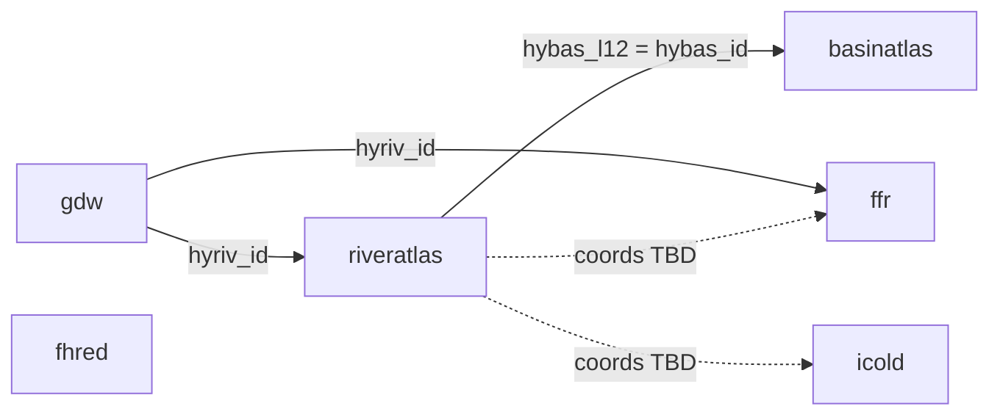

# Super Basin Atlas Dam Database (SuperBADD)


The purpose of the **Super Basin Atlas Dam Database** links two major global current dam datasets (Global Dam Watch and ICOLD) to river-network context from HydroATLAS and connectivity metrics from the Free-Flowing Rivers dataset. These large datasets are can be very computationally expensive to work with, the goal of SuperBADD is to enable quick SQL-based exploration of how river attributes relate to the dams.

## Data Access

Raw data is free and accessible online at the links below. Obtain **GDW v1.0**, **HydroATLAS v10** (BasinATLAS + RiverATLAS), and **FFR v1** from Global Dam Watch / HydroSHEDS, as well as **FHReD** and **ICOLD** spreadsheets; place them under `data/raw/` using the names in `scripts/clean_data.py`. 

| Table | Source | Role |
|--------|--------|------|
| `gdw` | [Global Dam Watch](https://www.globaldamwatch.org/) | Dam points, discharge, capacity, `hyriv_id` |
| `riveratlas` | [HydroATLAS RiverATLAS](https://www.hydrosheds.org/hydroatlas) | Reach geometry, `main_riv`, `hybas_l12`, climate/terrain covariates |
| `basinatlas` | [HydroATLAS BasinATLAS](https://www.hydrosheds.org/hydroatlas) | Basin polygons, `hybas_id` |
| `ffr` | [Free-Flowing Rivers](https://figshare.com/articles/dataset/Mapping_the_world_s_free-flowing_rivers_data_set_and_technical_documentation/7688801) | Segment-scale connectivity and discharge metrics on `hyriv_id` |
| `fhred` | [FHReD 2015](https://www.globaldamwatch.org/fhred/) | Planned / future dams → `fhred.parquet` |
| `icold` | [ICOLD World Register](https://www.icold-cigb.org/GB/publications/world_register_of_dams.asp) | Alternative Current-dam register (separate from GDW) → `icold.parquet` |

### Entity-relationship diagram



## Repo Organization

```
├── data
│   ├── clean                                     # Cleaned parquest files
│   │   ├── basinatlas.parquet
│   │   ├── ffr.parquet
│   │   ├── fhred.parquet
│   │   ├── gdw.parquet
│   │   ├── icold.parquet
│   │   └── riveratlas.parquet
│   └── raw                                       # Raw data not included, but after download should resemble
│       ├── BasinATLAS_v10.gdb
│       ├── FFR_river_network.gdb
│       ├── FHReD_2015_future_dams.xlsx
│       ├── GDW_v1_0.gdb
│       ├── RiverATLAS_v10.gdb
│       └── world_register_dams_2025.xlsx
├── database                                      # Database file will resemble. Folder will be present
│   └── superbadd.duckdb
├── LICENSE
├── meta                                          # Metadata document for exploring attributes
│   ├── BasinATLAS_Catalog_v10.pdf
│   ├── FHReD_Metadata_2018.docx
│   ├── GDW_TechDoc_v1_0.pdf
│   ├── HydroATLAS_TechDoc_v10.pdf
│   ├── HydroATLAS_v10_Legends.xlsx
│   ├── ICOLD_meta.pdf
│   ├── Mapping the worlds free-flowing rivers - Technical documentation - v1_0.pdf
│   └── RiverATLAS_Catalog_v10.pdf
├── notebooks                                     # Python notebooks
│   ├── climate_csi_exploration.ipynb             # Exploring the CSI (FFR) of dammed rivers (GDW) in different climate zones (RiverATLAS)
│   ├── dam_river_network.ipynb                   # Explore specific dammed river networks with maps
│   └── data_cleaning.ipynb                       # Notebook for running clean_data.py cleanly
├── README.md                                     # README
├── requirements.txt                              # Environment Requirements 
├── scripts                                       # Python Scripts
│   ├── clean_data.py                             # Loads raw data cleans and saves .parquet file outputs
│   └── ingest.py                                 # Builds database.duckdb file using processes .parquets
├── sql                                           # SQL files
│   ├── analytical_query.sql                      # Example SQL query
│   └── verify_ingestion.sql                      # Check to ensure database was created successfully before exploring                                
|   └── build_db.sql                              # Simplified database builder in SQL, alternative to ingest.py
```

## Reproduce

1. **Python 3.10+** and a virtual environment.
2. `pip install -r requirements.txt`.
3. Put source files under `data/raw/` (paths and sheet rules live in `scripts/clean_data.py`).
4. From the **repository root**:

```bash
python scripts/clean_data.py
python scripts/ingest.py
```

5. Open the notebooks with the repo root (`/SuperBasinDamDatabase`) as the working directory when possible.

## References

- This repository was made in the course **EDS 213: Databases and Data Management** at the [UCSB Bren School](https://bren.ucsb.edu/) as part of the Masters of Environmental Data Science Program.
- Huge thank you to the creators of the source datasets: **Global Dam Watch**, **HydroATLAS**, **Free-Flowing Rivers**, **FHReD**, and **ICOLD**.
- And the professors and TAs who helped with the workflow, SQL, and Python: **Annie Adams**, **Julien Brun** and **Greg Janee**.

